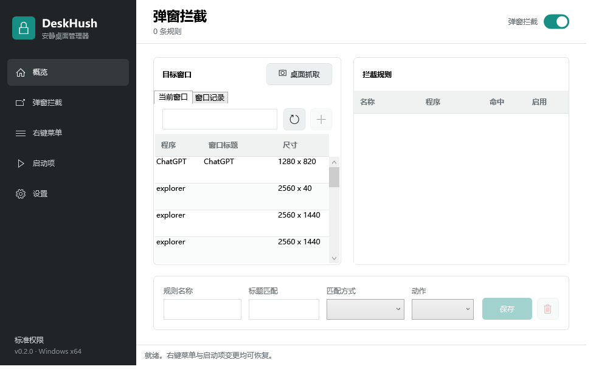

# DeskHush

> 安静桌面管理器：在一个轻量的 Windows 工具中管理弹窗规则、资源管理器右键菜单和常见登录启动项。

[English](README_EN.md) · [下载最新版](https://github.com/sanrokamlan-prog/DeskHush/releases/latest) · [安全与恢复](docs/safety-and-recovery.md) · [架构](docs/architecture.md)

[](https://github.com/sanrokamlan-prog/DeskHush/actions/workflows/ci.yml)
[](https://github.com/sanrokamlan-prog/DeskHush/releases/latest)
[](LICENSE)

DeskHush 是一个开源的 Windows 桌面工具。它可以通过桌面抓取或后台窗口记录快速定位难以捕捉的弹窗，同时管理资源管理器右键菜单和常见登录启动项。它不安装驱动，不向其他进程注入代码，也不会为了刷新右键菜单而自动重启资源管理器。涉及注册表或启动文件夹的变更会保留恢复状态，发生路径冲突时默认拒绝覆盖。



## 直接下载使用

当前发行包面向 **Windows 10/11 x64**。

1. 打开 [Releases](https://github.com/sanrokamlan-prog/DeskHush/releases/latest)，下载 `DeskHush-v*-win-x64.zip` 和 `SHA256SUMS.txt`。
2. 校验压缩包的 SHA-256，然后解压到一个固定、可写的目录，例如 `D:\Apps\DeskHush`。不要直接在压缩包内运行。
3. 启动 `DeskHush.exe`。发行包为自包含构建，不要求另行安装 .NET 运行时。
4. 如需持续拦截，在“设置”中保留“关闭窗口时最小化到托盘”；如需登录后自动运行，再启用“开机启动”。

> 当前公开发行版未进行代码签名，Windows SmartScreen 可能显示未知发布者。只应从本仓库的 Release 下载并核对校验和；无法确认来源时不要绕过警告。

窗口关闭后，DeskHush 默认继续在通知区域运行。双击托盘图标可重新打开，完整退出请使用托盘菜单中的“退出”。

## 功能范围

| 模块 | 当前能力 | 变更方式 |
| --- | --- | --- |
| 弹窗拦截 | 当前窗口列表、桌面抓取、后台窗口记录；按进程名/路径、窗口类和标题匹配；支持包含、精确、通配符、正则；动作可选关闭或隐藏 | 桌面抓取自动框选可识别窗口；监听 `EVENT_OBJECT_SHOW` 并按规则发送 `WM_CLOSE` 或隐藏窗口 |
| 右键菜单 | 文件、文件夹、文件夹空白处、磁盘、桌面、所有文件系统对象；静态 verb 与 shell extension；HKCU/HKLM、32/64 位视图 | 静态 verb 使用 `LegacyDisable`；扩展处理器使用当前用户 `Shell Extensions\Blocked` |
| 启动项 | 当前用户/所有用户的 `Run`、`RunOnce`，当前用户/公共启动文件夹，以及可对应的任务管理器启用状态 | 保存注册表值和 `StartupApproved` 原状态；启动文件夹项目移入恢复目录 |
| 后台运行 | 单实例、托盘运行、关闭/最小化到托盘、后台参数 | `DeskHush.exe --background` |
| 开机启动 | 当前用户登录后静默启动到托盘 | 写入 HKCU `Run` 中仅属于 DeskHush 的值 |
| 版本提示 | 每天静默检查一次公开 Release，可关闭或手动检查 | 只读取 GitHub Release 元数据；点击后用浏览器打开下载页 |

启动项管理器目前**不枚举或修改计划任务、Windows 服务、驱动和其他自动启动扩展点**。枚举模型中预留的类型不代表这些能力已经实现。

## 弹窗规则

可通过三种方式选取目标：从“当前窗口”列表选择；使用“桌面抓取”冻结整个虚拟桌面并点击自动标出的窗口；或开启“窗口记录”，等待短暂弹窗出现后从历史中创建规则。后两种方式适合停留时间短、难以在列表刷新时选中的窗口。

桌面抓取会先隐藏 DeskHush 主窗口，只在内存中生成一次虚拟桌面画面并标出当时可识别的顶层窗口。画面不会写入文件，选择器关闭后即释放。窗口记录在后台保存新出现窗口的进程、标题、窗口类、位置和尺寸，最多保留 500 条；记录只存在于当前进程内存中，可随时清空，退出 DeskHush 后不会保留，也不会上传。

无论从哪种入口创建，每条规则都必须同时满足：

- 限定到具体进程名或完整进程路径；
- 指定窗口标题或窗口类，避免把程序主窗口当作弹窗；
- 通过系统关键进程保护校验。

规则匹配不区分大小写。窗口类使用通配符匹配，标题支持包含、完全相同、通配符和带超时限制的正则表达式。系统会记录命中次数和最近命中时间，但不会收集或上传窗口数据。

“关闭”会向窗口发送正常关闭消息，目标程序仍可拒绝处理；“隐藏”不会结束进程，但被隐藏的窗口通常需要由目标程序重新显示或重启目标程序后恢复。新建规则默认使用“隐藏”；若记录时标题尚未生成，规则会保持暂停，需补充或确认匹配条件后再启用。

## 右键菜单管理

DeskHush 会扫描当前用户和本机范围内的 32/64 位注册表视图，并展示注册表来源、处理器命令和可解析的发布者信息。

- 静态菜单项：通过增加或移除 `LegacyDisable` 标记切换状态。
- Shell 扩展：通过当前用户级 `Shell Extensions\Blocked` 列表按 CLSID 切换状态；这可以覆盖当前用户和本机注册的处理器。
- 原始标记状态会写入恢复文件，恢复时回到 DeskHush 首次修改前的状态。
- 资源管理器可能缓存菜单。DeskHush 不会自动结束 `explorer.exe`；必要时请自行关闭并重新打开相关窗口，或重新登录。

本机范围的静态菜单项通常需要管理员权限。应用默认以普通用户运行，可在设置页选择“以管理员身份重新启动”。

## 启动项管理

DeskHush 会同时读取 Windows 任务管理器为持久 `Run` 项和启动文件夹维护的 `StartupApproved` 状态。关闭原本启用的注册表启动项时，会保存原始值类型、内容以及存在对应关系时的批准状态，随后删除活动值；恢复时逐项校验。对任务管理器原本已禁用的项目执行启用时，则会保存其完整批准值并在再次关闭时恢复原状态。启动文件夹项目采用同样的批准状态保护，实际文件或目录会移动到 DeskHush 的恢复目录。`RunOnce` 没有可靠的一一对应批准入口，因此只按其源注册表值管理，不会错误套用同名 `Run` 状态。

如果原位置出现同名注册表值或文件，恢复操作会停止并保留备份，不会覆盖新内容。所有用户范围的 `Run`/`RunOnce` 和公共启动文件夹项目需要管理员权限。

“启动项”页面管理的是其他程序的登录启动入口；设置页的“开机启动”只控制 DeskHush 自身，二者相互独立。

## 版本提示

默认每天最多检查一次公开的 GitHub Release 元数据。发现更高版本时，DeskHush 会在设置页和通知区域提示；只有点击后才会打开 Release 页面，不会自动下载、安装或替换程序。自动检查可在设置页关闭，手动检查仍然可用。

检查请求不携带 GitHub 登录凭据、规则或窗口数据，但会像普通网络请求一样向 GitHub 暴露 IP 地址和 DeskHush 版本号。检查失败不会影响弹窗拦截、窗口记录或后台启动。

## 安全设计

- 弹窗监听使用 WinEvent out-of-context 回调，不注入目标进程，不加载第三方模块。
- 桌面抓取画面和窗口记录只在内存中处理；不写入截图、不持久化记录、不上传窗口数据。
- 拦截规则必须限定程序和窗口特征，并拒绝系统关键进程。
- 右键菜单和启动项都先记录恢复状态，再执行可逆变更。
- 恢复时遇到并发修改或目标冲突会停止，不静默覆盖。
- 默认以当前用户权限运行；仅在修改本机范围项目时按需提权。
- 配置保存在本机，不包含遥测、云同步或规则下载功能；可选的版本检查只读取公开 Release 元数据。

这些保护不能替代系统还原点、注册表导出或完整备份。首次管理关键软件前，请阅读 [安全与恢复](docs/safety-and-recovery.md)。

## 数据位置与卸载

DeskHush 的状态默认保存在：

```text
%LOCALAPPDATA%\DeskHush\
├── settings.json
├── context-menu-state.json
├── startup-state.json
└── disabled-startup\
```

桌面抓取画面和窗口记录不属于持久状态，因此不会出现在上述目录中。

不要在仍有禁用项目时删除此目录。正确卸载顺序是：先在 DeskHush 中恢复需要保留的右键菜单和启动项，关闭 DeskHush 自身的开机启动，从托盘完整退出，再删除程序目录；确认恢复完成后才删除数据目录。详细步骤见 [安全与恢复](docs/safety-and-recovery.md)。

## 从源码构建

要求：Windows 10/11、[.NET 8 SDK](https://dotnet.microsoft.com/download/dotnet/8.0)。

```powershell
dotnet restore DeskHush.sln
dotnet build DeskHush.sln -c Release --no-restore
dotnet run --project tests/DeskHush.Tests/DeskHush.Tests.csproj -c Release
```

正式发行包不在开发者本机制作。版本号更新并推送匹配标签（例如 `v0.2.0`）后，[Release workflow](.github/workflows/release.yml) 会在 GitHub Actions 的 Windows 环境中运行严格编译和测试，生成自包含 x64 单文件 ZIP、`SHA256SUMS.txt`，上传到对应 Release，并将同一份产物在 Actions 中保留 14 天。

需要在本地复现同一构建流程时，可运行：

```powershell
./scripts/build-release.ps1 -Version 0.2.0
```

测试项目是无第三方测试框架依赖的控制台测试运行器，包含规则匹配与安全校验、设置持久化、窗口记录队列/重试/容量/去重、版本比较、窗口枚举、右键菜单只读枚举和启动项只读枚举。后三类系统冒烟测试会读取当前 Windows 环境，但不会修改系统状态。

## 架构

```text
DeskHush.App       WPF 界面、托盘、单实例与应用生命周期
    ├── DeskHush.Core      模型、接口、规则匹配与持久化
    └── DeskHush.Windows   Win32 事件、注册表与启动文件夹适配
```

依赖只从 UI/平台层指向 Core；平台行为通过接口交给 ViewModel。更多状态流、恢复事务和扩展边界见 [架构说明](docs/architecture.md)。

## 参与项目

提交问题前请附上 Windows 版本、DeskHush 版本、目标项目的“范围/类型/注册表来源”，并删除路径中的个人信息。代码贡献请先阅读 [CONTRIBUTING.md](CONTRIBUTING.md)；安全问题请按 [SECURITY.md](SECURITY.md) 私下报告。

## 免责声明

本工具会修改用户选择的注册表值和启动文件夹内容。请审阅目标项目并保留系统备份；使用风险由使用者自行承担。项目按 MIT License 以“现状”提供，不附带任何保证。

## 许可证

[MIT License](LICENSE) © 2026 DeskHush contributors.
