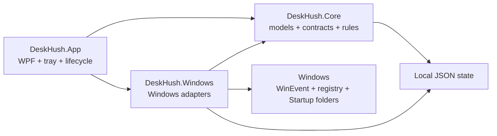
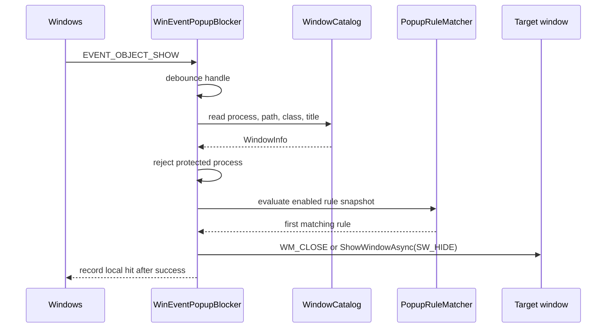

# DeskHush Architecture

## Goals and boundaries

DeskHush combines three narrowly scoped Windows-management capabilities behind one desktop lifecycle:

1. observe newly shown top-level windows and apply explicit user rules;
2. enumerate and reversibly toggle common Explorer context-menu registrations;
3. enumerate and reversibly toggle `Run`, `RunOnce`, and Startup-folder entries.

The current design intentionally excludes drivers, process injection, Explorer restarts, scheduled-task management, service management, cloud rule delivery, and automatic updates.

## Project structure

| Project | Responsibility | May depend on |
| --- | --- | --- |
| `DeskHush.Core` | Models, interfaces, popup-rule matching/validation, stable IDs, JSON settings | .NET base libraries |
| `DeskHush.Windows` | Win32 interop, window catalog, WinEvent popup engine, registry and Startup-folder adapters | `DeskHush.Core` |
| `DeskHush.App` | WPF UI, ViewModel orchestration, tray, single instance, elevation restart, app startup registration | `DeskHush.Core`, `DeskHush.Windows` |
| `DeskHush.Tests` | Pure-logic tests and read-only Windows enumeration smoke tests | `DeskHush.Core`, `DeskHush.Windows` |

The ViewModel consumes Core interfaces rather than registry or Win32 primitives. The Windows project owns platform-specific handles, registry views, elevation checks, and file moves.

## Application lifecycle

DeskHush uses a named mutex to enforce a single instance. A second launch signals the existing process through a named event and then exits. The first instance owns the WPF window, popup engine, state stores, and notification-area icon.

Normal startup shows the window. `--background` initializes the same services without activating or showing the taskbar window, then remains available from the tray. Closing or minimizing hides the window when the corresponding setting is enabled; only the tray **Exit** action tears down the hook and process.

The “Start with Windows” setting writes one current-user `Run` value named `DeskHush` whose command is the current executable path plus `--background`. It is separate from the startup-entry manager.

## Popup event flow

`SetWinEventHook` is registered with `WINEVENT_OUTOFCONTEXT` and `WINEVENT_SKIPOWNPROCESS`. The callback queues evaluation to the thread pool and does not load code into the target. A short delay lets newly shown windows populate their metadata; per-handle debounce avoids repeated actions during the same show burst.

A valid rule must identify a process and at least one window characteristic. Title regexes use a short timeout. Validation and runtime checks protect critical system process names, while DeskHush itself and Explorer are also rejected by the engine.

The action is cooperative rather than forceful: `WM_CLOSE` can be ignored, and hiding a window does not stop its process.

## Context-menu flow

Enumeration crosses HKCU and HKLM in each available 32/64-bit registry view. It reads these logical locations under `Software\Classes`:

- file (`*`);
- folder (`Directory` and `Folder`);
- folder background (`Directory\Background`);
- drive (`Drive`);
- desktop (`DesktopBackground`);
- all filesystem objects (`AllFilesystemObjects`).

Static verbs are found below `shell`; shell-extension handlers are found below `shellex\ContextMenuHandlers`. Stable IDs include kind, hive, registry view, path, and handler CLSID, so entries from different scopes remain distinct.

For static verbs, disabled state is represented by the `LegacyDisable` marker on the verb key. For shell extensions, disabled state is represented by a CLSID value in the current user's `Software\Microsoft\Windows\CurrentVersion\Shell Extensions\Blocked` key. The per-user block list can suppress handlers registered in either scope without modifying the handler's original registration.

Before its first marker change, DeskHush writes whether that marker originally existed to `context-menu-state.json`. Returning to the original state removes the recovery record. Machine-scope static verbs require elevation; shell-extension blocking remains a per-user operation. Explorer refresh is left to the user.

## Startup-entry flow

The manager enumerates the native shared HKCU view, both HKLM registry views on 64-bit Windows, and both `Run`/`RunOnce` keys. It also enumerates the current user's Startup folder and the common Startup folder. Persistent `Run` entries and Startup-folder items include the matching Explorer `StartupApproved\Run`, `Run32`, or `StartupFolder` value used by Task Manager. `RunOnce` intentionally has no approval mapping because a same-name `Run` value may be unrelated.

### Registry entry transaction

1. Capture the exact registry value kind/content and, for persistent `Run`, its complete `StartupApproved` value without expanding environment strings.
2. Persist the backup record to `startup-state.json`.
3. Delete the live value and verify absence.
4. On restore, refuse to overwrite an existing value, write the captured value, and compare the result to the snapshot.
5. For mapped entries, verify that the restored source is permitted by `StartupApproved`, then remove the recovery record.

If an entry was already disabled by Task Manager, DeskHush leaves its source in place. Enabling it writes a canonical enabled approval value only after persisting the complete original value; switching it off again restores that original byte sequence instead of deleting the source.

Supported snapshots preserve strings, expandable strings, multi-strings, binary/none values, DWORDs, and QWORDs.

### Startup-folder transaction

1. Record the normalized original path, item type, expected disabled path, and matching `StartupApproved` value.
2. Persist the recovery record.
3. Move the file or directory beneath `disabled-startup/<stable-id>/` and verify source/destination state.
4. On restore, validate that both paths remain within their expected roots and refuse to overwrite an item at the original path.
5. Remove the recovery record only after a verified move back.

All-users registry entries and the common Startup folder require elevation. State documents are validated before use. The startup store also fingerprints the last-read state file and refuses a save if another writer changed it.

## Persistence

Default state root: `%LOCALAPPDATA%\DeskHush`.

| Path | Owner | Contents |
| --- | --- | --- |
| `settings.json` | Core/App | Popup engine setting, tray/startup preferences, popup rules and hit data |
| `context-menu-state.json` | Windows context-menu adapter | Original marker-presence records for DeskHush changes |
| `startup-state.json` | Windows startup adapter | Registry snapshots, Startup-folder move records, and `StartupApproved` originals |
| `disabled-startup/` | Windows startup adapter | Disabled Startup-folder files/directories |

Settings and recovery state use write-then-move persistence. A malformed settings file is moved aside and defaults are loaded. Invalid startup recovery data is left untouched and reported rather than guessed at.

## Privilege model

The manifest requests `asInvoker`. Reading system locations and current-user changes work without elevation. A machine-scope mutation returns a result indicating that elevation is required; the UI can then explicitly restart the whole process using the Windows `runas` verb. There is no silent privilege escalation or privileged background service.

Because an elevated instance has broader access, normal tray use should remain unelevated. Elevation should be limited to the specific machine-scope recovery or change, followed by a normal restart.

## Extension criteria

A new Windows surface is complete only when enumeration, identity, scope, privilege behavior, mutation, verification, conflict handling, persistence, recovery, and tests are all defined. In particular, the `ScheduledTask` model value is reserved only; scheduled tasks and services are not part of the current implementation.

## Validation strategy

Pure logic is covered for matching modes, composite matching, protected-process validation, stable IDs, settings round trips, and malformed-settings recovery. Windows smoke tests enumerate visible windows, context-menu entries, and startup entries and verify stable unique IDs. Mutating registry and filesystem paths should be validated in a disposable Windows VM because a unit test cannot reproduce Explorer caching, policy restrictions, or third-party installers racing on the same keys.
